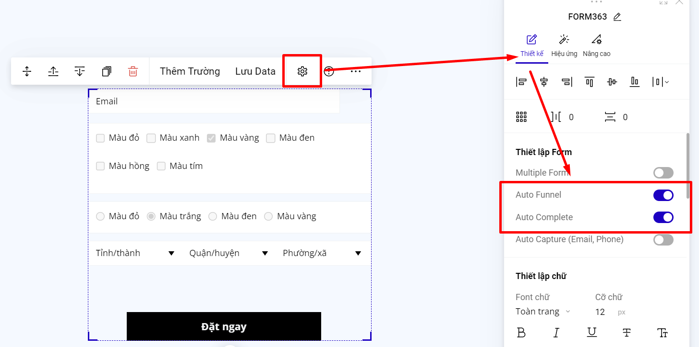

# Auto Funnel, Auto Complete

Để sử dụng Auto Funnel và Auto Complete bạn vào phần thiết lập của form--> bật Có Auto Funnel và Auto Complete.

<figure><figcaption></figcaption></figure>

**Auto Funnel**: tính năng giúp bạn lấy thông tin khách hàng đã đăng ký thành công trên form lên trang cảm ơn riêng popup cảm ơn riêng của bạn hoặc popup cảm ơn mặc định.

**Cách thực hiện như sau:**

Bạn lấy tên lấy dữ liệu của trường form đăng ký.

<figure><figcaption></figcaption></figure>

Trên trang cảm ơn riêng, popup cảm ơn riêng hoặc popup cảm ơn mặc định bạn thêm văn bản có mẫu \{{tênlấydữliệu\}} ví dụ như sau:

<figure><figcaption></figcaption></figure>

**Auto Complete**: Nếu khách hàng điền thông tin trên form và bấm submit thành công, thì trang sẽ ghi nhận thông tin đó trên form để những lần sau khách hàng vào trang, sẽ không cần điền lại thông tin nữa. Còn các khách hàng mới vào trang lần đầu tiên sẽ không nhìn thấy các thông tin, mà sẽ là các gợi nhắc trên form bạn cài đặt ạ.

Áp dụng cho form có chứa các trường thông tin:&#x20;

```
'name', 'email', 'phone', 'address'
```
