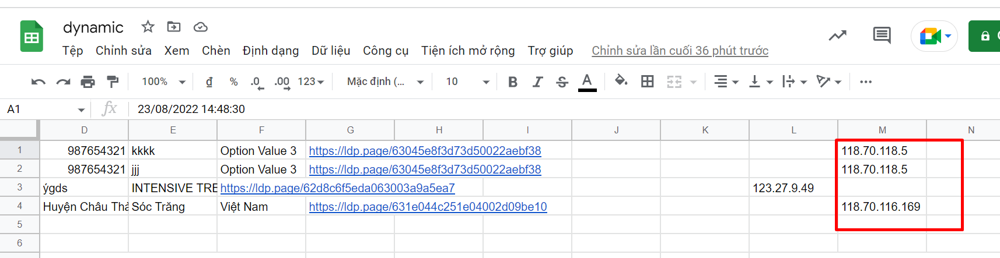
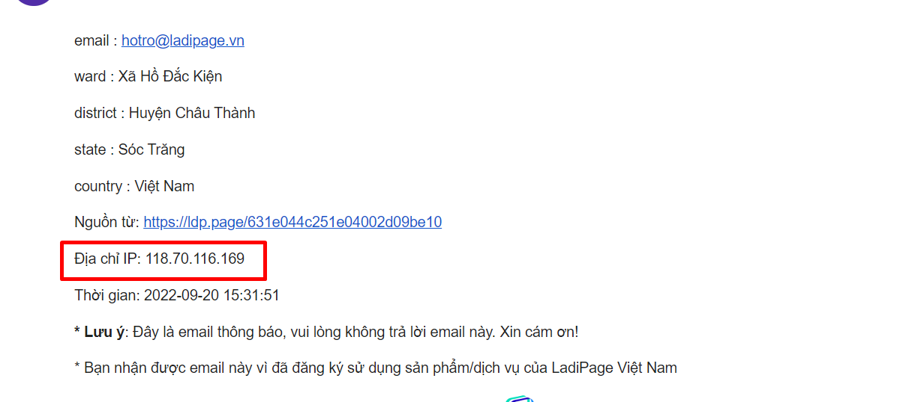

# Blacklist IP

LadiPage không hỗ trợ chặn truy cập vào trang landing page, nếu bạn gặp trường hợp bị spam data về kênh lưu trữ, bạn có thể cài đặt Blacklist IP để giảm thiểu một phần tình trạng spam data.

Những khách hàng có IP mạng trong danh sách Blacklist IP vẫn sẽ truy cập được trang landing page, vẫn điền thông tin trên form đăng ký và bấm submit form thành công, tuy nhiên các data này sẽ **Không về kênh lưu trữ của bạn**, **khi bạn tải dữ liệu backup vẫn sẽ hiển thị những data này.**

Để cài đặt Blacklist IP, bạn vào **Landing Pages --> Cấu hình form--> Chọn thao tác (icon ...)** ở cuối cấu hình form--> **Chọn Blacklist IP.**

<figure><figcaption></figcaption></figure>

Bạn nhập IP muốn chặn tại danh sách IP, mỗi IP bạn enter xuống dòng và bạn có thể chặn theo một tập hợp các địa chỉ IP bằng cách thay thế các chữ số cuối bằng dấu hoa thị (\*). Mỗi giá trị là một dòng.

<figure><figcaption></figcaption></figure>

Bạn có thể lấy IP của khách spam bằng cách vào tài khoản liên kết, sao chép IP trả về của data bạn muốn chặn IP.

<figure><figcaption></figcaption></figure>

<figure><figcaption></figcaption></figure>
