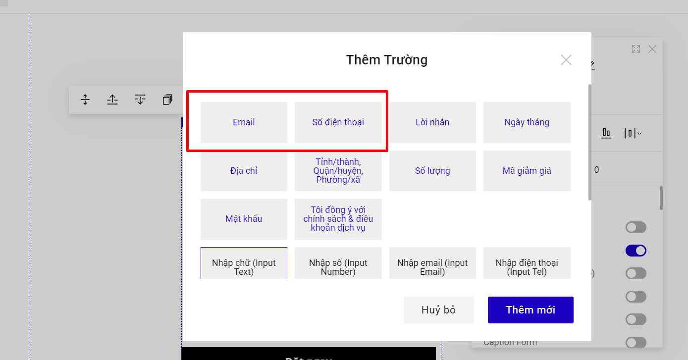
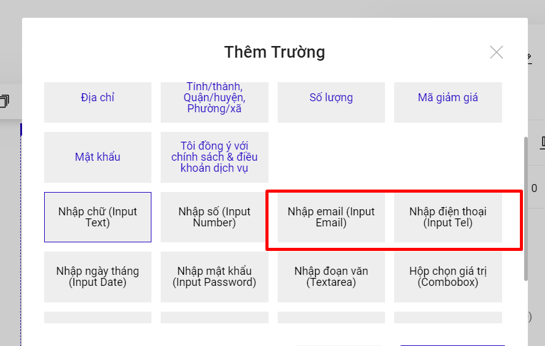

# Capture Form

**Nguyên lý hoạt động của Capure Form:** Khi khách hàng nhập thông tin vào 1 trong 2 trường Phone và Email, di con trỏ chuột ra khỏi form đăng ký đó thì hệ thống sẽ tự động gửi Data đi mà không cần khách hàng bấm nút Submit.

Capture Form sẽ chỉ áp dụng khi bạn tạo form đăng ký chứa 2 trường: **Số điện thoại và Email**. &#x20;

<figure><figcaption></figcaption></figure>

Capture Form sẽ **Không** thể hoạt động khi bạn sử dụng trường Nhập email (Input Email) và Nhập điện thoại (Input Tel) hoặc các trường khác.

<figure><figcaption></figcaption></figure>

Data dạng Capture Form sau 10 phút khách hàng thoát khỏi form đăng ký sẽ được gửi đi (Khách hàng tiếp tục bấm Submit thì vẫn ghi nhận thêm dữ liệu 1 lần nữa).&#x20;

Trên các kênh lưu trữ, sẽ có hiện thêm phần ghi chú dữ liệu đến từ **Capture Form**. Tải dữ liệu Backup thì data Capture Form sẽ ở cuối cùng của data backup.

.png>)

.png>)

**Cách thiết lập tính năng:**

Bạn vào phần Thiết lập của form-->Thiết kế--> Auto Capture--> chọn **Có** để bật tính năng và sử dụng.

<figure><figcaption></figcaption></figure>

&#x20;


**Lưu ý : Tính năng chỉ áp dụng cho gói có tính năng phân quyền thành viên (Premium/Enterprise/Business)**

**Dữ liệu capture form về kênh lưu trữ, backup bao gồm : email/sdt và các trường thông tin được điền trước khi nhập thông tin email/sdt trên form**

