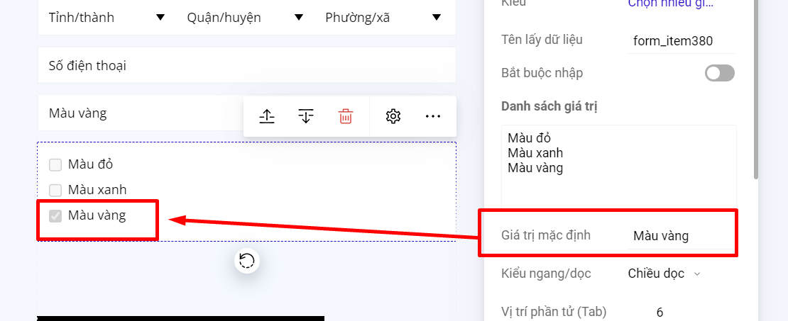
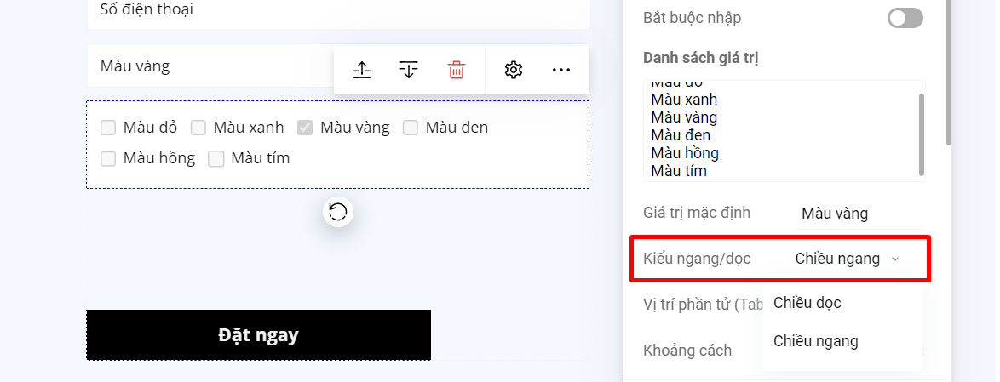

# Chọn nhiều giá trị

Kiểu trường này đưa ra tất cả các lựa chọn và người dùng lựa chọn bằng cách tích vào ô giá trị, có thể lựa chọn nhiều giá trị cùng lúc. Ví dụ khi hiển thị ra Landing Page:

.png>)

Để thiết lập bạn chọn loại trường "Chọn nhiều giá trị". Trong ô điền Danh sách giá trị, bạn điền giá trị sau đó enter xuống dòng để mỗi giá trị là một dòng như ví dụ hình dưới:

<figure><figcaption></figcaption></figure>

Nếu bạn muốn khi khách hàng truy cập vào landing page, trường Chọn nhiều giá trị của form đăng ký có chọn sẵn 1 giá trị, thì bạn nhập giá trị mặc định là 1 trong các giá trị của danh sách giá trị.

<figure><figcaption></figcaption></figure>

Bạn có thể sắp xếp các giá trị của trường Chọn nhiều giá trị theo kiểu chiều ngang hoặc chiều dọc.

<figure><figcaption></figcaption></figure>


**Lưu ý:**

Phần hiển thị ô tích chọn trước các giá trị là mặc định, không thể chỉnh sửa và thay đổi.


