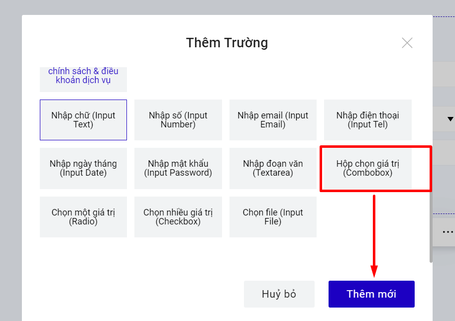
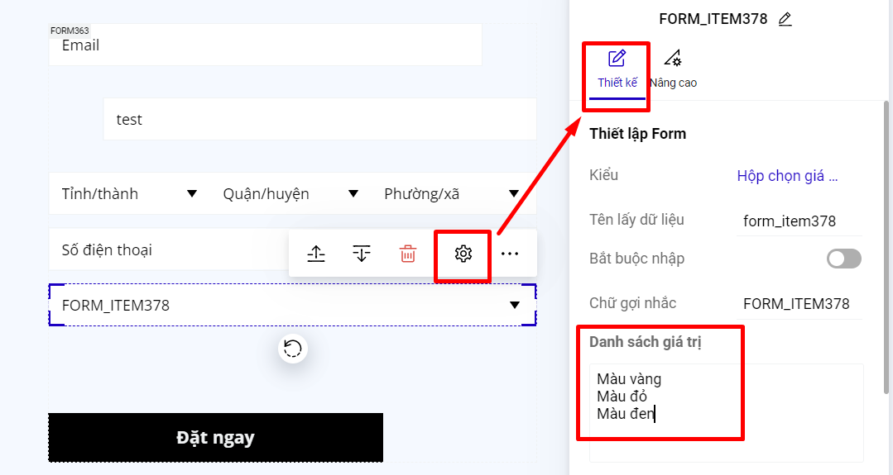
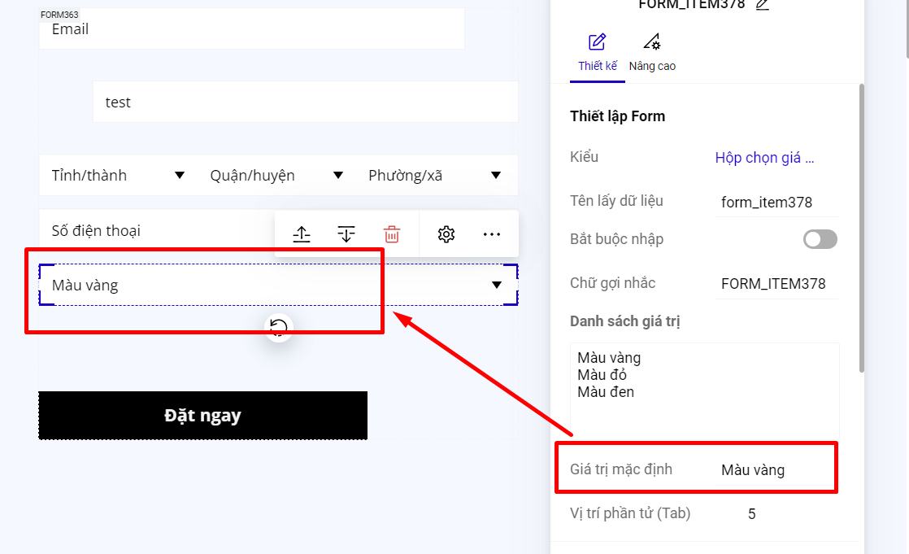

# Hộp chọn giá trị (Combobox)

Kiểu hộp chọn giá trị cho phép bạn đưa ra nhiều lựa chọn dưới dạng menu thả xuống, không tốn diện tích.&#x20;

<figure><figcaption></figcaption></figure>

Khi xuất bản sẽ được hiển thị như sau:

.png>)

Để thiết lập bạn chọn trường "Hộp chọn giá trị". Trong ô điền Danh sách giá trị, bạn điền giá trị sau đó enter xuống dòng để mỗi giá trị là một dòng như ví dụ hình dưới:

<figure><figcaption></figcaption></figure>

Nếu bạn muốn khi khách hàng truy cập vào landing page, trường Combobox của form đăng ký hiển thị sẵn 1 giá trị, thì bạn nhập giá trị mặc định là 1 trong các giá trị của danh sách giá trị.

<figure><figcaption></figcaption></figure>
