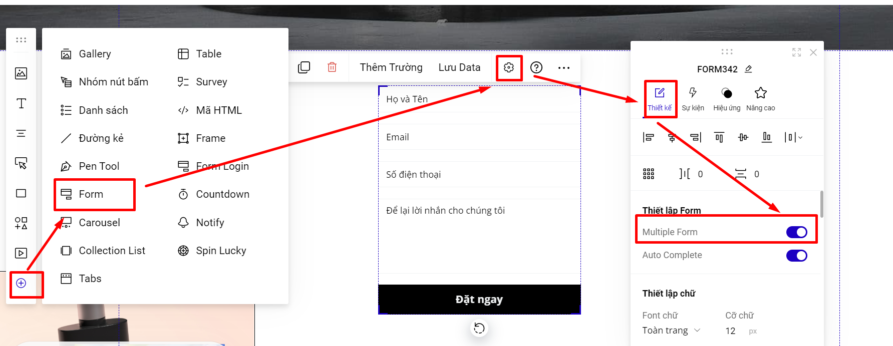
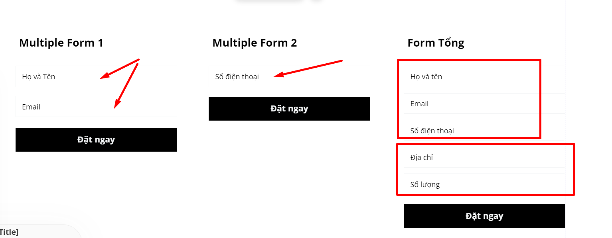

# Multiple Forms

Tính năng cho phép bạn tạo nhiều form đăng ký để khách hàng điền lần lượt thông tin và liên kết đến 1 form tổng cuối cùng để đăng ký (submit) dữ liệu.

**Bước 1: Bật Multiple form cho form.**

Tại thanh công cụ nhanh--> chọn Form--> tạo 1 form đăng ký (có thể thêm bớt trường cho form) --> Thiết lập của Form --> bật tính năng Multiple Form (Multiple Form sẽ được coi là form con, bạn có thể bật nhiều multiple form của form đăng ký để tạo nhiều form con).

<figure><figcaption></figcaption></figure>

**Khi form bật tính năng Multiple Forms thì sẽ KHÔNG có tính năng Auto Funnel, Không có phần thiết lập Lưu trữ form.**

**Bước 2: Thiết lập thông tin cho Multi Form**&#x20;

Bạn vào mục Form -> Lưu data&#x20;





Tại mục Thêm hành động , bạn chọn phần hành động **Liên kết Form -> Bạn chọn liên kết đến FORM tổng mà bạn mong muốn**&#x20;



* Bạn chọn Form trong danh sách liên kết. Form này sẽ được coi là Form Tổng của các Multiple forms (form con).
* Nhiều Multiple form có thể liên kết tới 1 Form tổng.
* Form tổng bạn tạo yêu cầu phải chứa tất cả các trường của các Multiple forms và tên lấy dự liệu của Form tổng phải trùng với tên lấy dữ liệu của Multi forms.

Ví dụ: Bạn tạo 2 Multiple form 1 có trường Họ tên và Email và Multiple form 2 có trường Số điện thoại, thì Form Tổng sẽ bao gồm các trường của 2 Multiple form và bạn có thể thêm các trường khác trên Form Tổng.

<figure><figcaption></figcaption></figure>

Nếu bạn không muốn hiển thị lại các trường của Multiple Form trên Form Tổng, bạn có thể ẩn các trường này.

<figure><figcaption></figcaption></figure>

* Form Tổng cần phải lưu trữ data để bạn có thể nhận data. Bạn xem hướng dẫn phần lưu data [tại đây](https://help.ladipage.vn/form-data/cac-buoc-cai-dat-luu-data).

#### **Mục 2 : Danh sách hành động**&#x20;

Sau khi khách hàng điền nội dung và bấm gửi (submit) dữ liệu ở Multiple form (form con), bạn có thể thực hiện hành động chuyển tiếp đến 1 section khác, mở tiếp 1 popup khác hoặc ẩn/hiện phần tử hoặc chuyển Tab.

Hành động tiếp theo có thể dẫn đến sự kiện chứa 1 Multiple form khác, hoặc tới luôn Form Tổng.



Chọn tương ứng hành động bạn muốn thực hiện, chọn ID section/popup/Tab tương ứng trên trang .


Định nghĩa về sự kiện chuyển Tab : [https://help.ladipage.vn/su-kien-cho-phan-tu/su-kien-chuyen-tab](https://help.ladipage.vn/su-kien-cho-phan-tu/su-kien-chuyen-tab)

