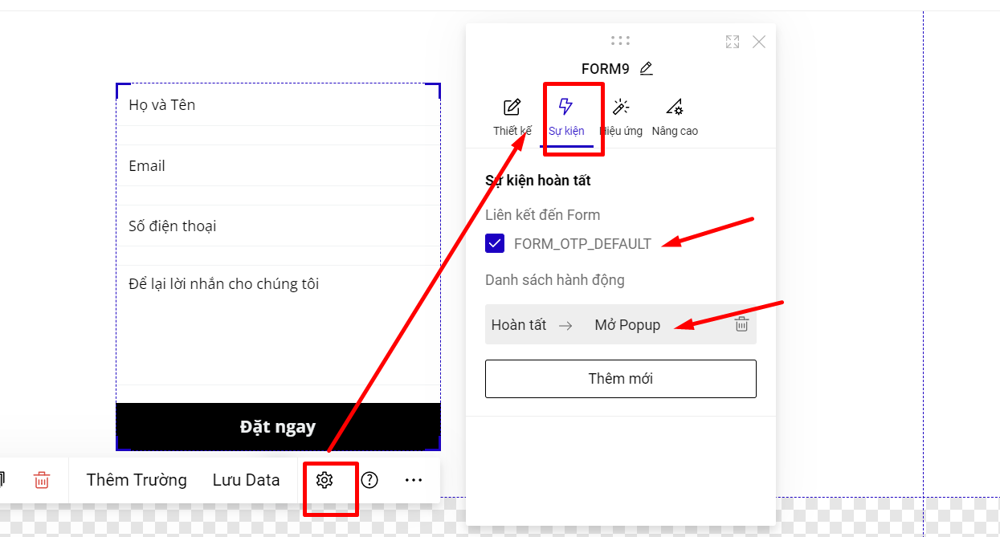

# OTP Form

OTP Form giúp bạn xác thực data bằng cách cung cấp mã OTP thông qua OTP :&#x20;

* Gửi tin nhắn sms đến số điện thoại đăng ký form ( thông qua ứng dụng eSMS)
* Gửi tin nhắn zalo đến số điện thoại đăng ký form (thông qua Zalo ZNS)&#x20;
* Gọi điện đến số điện thoại đến số điện thoại đăng ký form ( thông qua AI call )


Chi tiết phần thiết lập về các loại otp [tại đây ](https://help.ladipage.vn/form-data/cai-dat-chung-cho-form/otp-form/cach-thiet-lap-cac-kenh-gui-otp)


SMS ( sử dụng eSMS), Zalo ZNS hoặc call gọi điện vào số điện thoại khách hàng điền form đăng ký.&#x20;

Để cài đặt OTP Form bạn thao tác theo 2 cách sau:

**Cách 1: Sử dụng OTP Form mặc định.**

Nếu bạn sử dụng OTP Form mặc định, bạn chỉ cần vào Form chính bật OTP Form để sử dụng.

<figure><figcaption></figcaption></figure>

Sau khi khách hàng điền thông tin trên form đăng ký --> bấm submit, sẽ hiện popup chứa OTP form để khách hàng nhập OTP.

Như vậy phần sự kiện của Form chính sẽ mặc định đi liên kết tới OTP Form mặc định và sử dụng hành động Mở Popup.

<figure><figcaption></figcaption></figure>

Đồng thời tại danh sách Popup của bạn sẽ tự động thêm Popup\_OTP.

<figure><figcaption></figcaption></figure>

**Cách 2: Sử dụng OTP Form thủ công.**

**Bước 1: Kích hoạt OTP Form cho form chính.**

Tại form đăng ký chính, bạn bật OTP Form để sử dụng.

<figure><figcaption></figcaption></figure>

**Bước 2: Tạo Form OTP.**

* Bạn cần tạo Form OTP bằng cách vào mục Thêm mới   --> Phần tử --> Form --> Chọn Form OTP ở cuối danh sách Form.

<figure><figcaption></figcaption></figure>

* Bạn kiểm tra ID của Form OTP để sử dụng cho bước 3:

<figure><figcaption></figcaption></figure>

Form OTP sẽ không có phần Thêm trường, Lưu data, Auto complete và Auto capture.

**Bước 3: Thiết lập sự kiện liên kết cho OTP Form.**

* **Sự kiện hoàn tất:** Bạn cần liên kết Form chính tới Form OTP tại phần sự kiện. Bạn tích chọn vào ID Form OTP mà bạn tạo Form OTP tại bước 2.

<figure><figcaption></figcaption></figure>

* **Danh sách hành động:** Bạn có thể cài đặt để hiển thị Form OTP sau khi khách hàng điền thông tin tại Form chính.

<figure><figcaption></figcaption></figure>

[Hành động chuyển section](https://help.ladipage.vn/su-kien-cho-phan-tu/su-kien-nhap-chuot/su-kien-chuyen-section): Bạn đặt OTP Form tại 1 section, và sau khi submit thông tin trên form chính sẽ kéo tới section chứa OTP Form

[Hành động mở Popup](https://help.ladipage.vn/su-kien-cho-phan-tu/su-kien-nhap-chuot/su-kien-mo-popup): Bạn đặt OTP Form trên 1 popup và sau khi submit thông tin trên form chính sẽ mở ra chứa OTP Form.&#x20;

[Hành động Ẩn/hiện phần tử](https://help.ladipage.vn/su-kien-cho-phan-tu/su-kien-nhap-chuot/su-kien-an-hien-phan-tu): Sau khi thông tin trên form chính sẽ hiển thị ra OTP Form. Bạn cũng có thể ẩn Form chính khi sử dụng hành động Ẩn/hiện phần tử này.

[Hành động chuyển Tab](https://help.ladipage.vn/su-kien-cho-phan-tu/su-kien-nhap-chuot/su-kien-chuyen-tab): Bạn đặt OTP Form trên 1 Tab và sau khi thông tin trên form chính sẽ hiển thị ra Tab chứa OTP Form này.


**Lưu ý:**

* Bạn cần nạp tiền OTP để sử dụng tính năng này. Vui lòng liên hệ hotline 0972 220 777 hoặc nhắn livechat để được hỗ trợ.
* Số điện thoại điền form chính là đầu số Mobifone sẽ không nhận được cuộc gọi OTP  AI Call.
* Sau khi điền form đăng ký, nhập OTP và bấm xác nhận OTP thì mới được tính là data thành công, vì vậy khi đó mới hiện cảm ơn thiết lập ở Form chính và tính chuyển đổi đo lường tracking.
* Nếu khách hàng điền thông tin trên Form chính và không nhập OTP thì data đó cũng vẫn sẽ về kênh lưu trữ và backup data, thời gian trả về là sau 05 phút kể từ khi khách hàng điền data.


