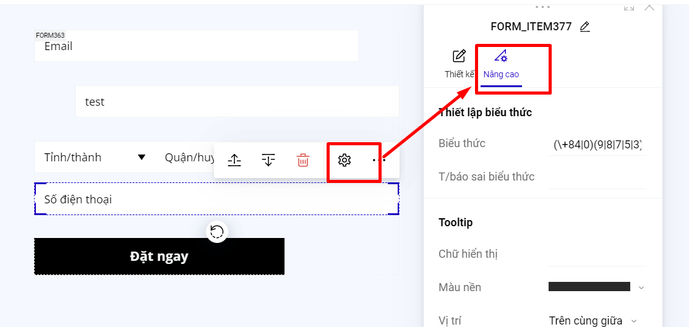

# Trường thông tin Số điện thoại

Bạn có thể cài đặt biểu thức cho trường số điện thoại của form như sau:

<figure><figcaption></figcaption></figure>

Trường thông tin số điện thoại mặc định của LadiPage đã có sẵn các biểu thức để đặt điều kiện cho việc điền số điện thoại của khách hàng. Bạn có thể chọn theo danh sách quốc gia, để ra các biểu thức gợi ý cho từng quốc gia đó.



Mô tả cụ thể biểu thức cho từng quốc gia :&#x20;

## Việt Nam&#x20;

* (\\+84|0)(9|8|7|5|3)\[0-9]{8}: sử dụng khi chạy quảng cáo trên lãnh thổ Việt Nam, khách hàng cần điền chính xác số điện thoại theo định dạng của Việt Nam (phải đủ 10 số, và bắt đầu bằng những đầu số đang hiện hành hợp lệ). Ví dụ: 09652919xx, 09824758xx hoặc +8498765432xx


Lưu ý : Nếu xuất bản với wordpress thì biểu thức là: (\\\\+84|0)(9|8|7|5|3)\[0-9]{8}


* \[0-9]{9,12}: chỉ nhập được dãy số có thành phần từ 0 đến 9, nhập được từ 9 đến 12 số.
* \[0-9]{9}: chỉ nhập được dãy số có thành phần từ 0 đến 9, chỉ nhập được 9 số.
* \[0-9]{10}: chỉ cần nhập 10 số đầu cuối bất kỳ.

## Brunei

Biểu thức chính quy `(\\+673|0)\\d{7}` được sử dụng để kiểm tra định dạng số điện thoại của Brunei. Dưới đây là phân tích chi tiết về công thức này:

1. **`(\\+673|0)`**:
   * `\\+673`: Đây là mã quốc gia của Brunei. Ký tự `+` được ký tự hóa bằng dấu gạch chéo ngược (`\\`) vì dấu `+` có ý nghĩa đặc biệt trong biểu thức chính quy.
   * `0`: Đây là cách viết số điện thoại nội địa ở Brunei, nơi số điện thoại thường bắt đầu bằng `0`.
2. **\d{7}**:
   * `\\d`: Đại diện cho bất kỳ chữ số nào từ 0 đến 9.
   * `{7}`: Xác định rằng phải có chính xác 7 chữ số tiếp theo sau mã quốc gia hoặc số `0`.

**Tóm lại:**

* Biểu thức chính quy `(\\+673|0)\\d{7}` yêu cầu số điện thoại phải bắt đầu bằng `+673` (mã quốc gia của Brunei) hoặc `0` (số điện thoại nội địa).
* Sau mã quốc gia hoặc số `0`, số điện thoại phải có chính xác 7 chữ số.

## Lào&#x20;

Biểu thức chính quy `(\\+856|0)20[0-9]{8}` được sử dụng để kiểm tra định dạng số điện thoại của Lào. Dưới đây là phân tích chi tiết về công thức này:

1. **(\\\\+856|0)**:
   * `\\+856`: Đây là mã quốc gia của Lào. Ký tự `+` được ký tự hóa bằng dấu gạch chéo ngược (`\\`) vì dấu `+` có ý nghĩa đặc biệt trong biểu thức chính quy.
   * `0`: Đây là cách viết số điện thoại nội địa ở Lào. Số điện thoại nội địa thường bắt đầu bằng số `0`.
2. **20**:
   * `20`: Phần này chỉ định rằng số điện thoại phải bắt đầu bằng 20 ngay sau mã quốc gia hoặc số `0`. Ở Lào, số điện thoại di động thường bắt đầu bằng 20
3. **\[0-9]{8}**:
   * `[0-9]`: Đại diện cho bất kỳ chữ số nào từ 0 đến 9.
   * `{8}`: Xác định rằng phải có chính xác 8 chữ số tiếp theo sau 20

## Campuchia

Biểu thức chính quy `(\+855|0)[1-9][0-9]{7,8}` được sử dụng để kiểm tra định dạng số điện thoại của Campuchia. Dưới đây là phân tích chi tiết về công thức này:

1. **(\\+855|0)**:
   * `\+855`: Đây là mã quốc gia của Campuchia. Ký tự `+` được ký tự hóa bằng dấu gạch chéo ngược (`\`) vì dấu `+` có ý nghĩa đặc biệt trong biểu thức chính quy.
   * `0`: Đây là cách viết số điện thoại nội địa ở Campuchia. Số điện thoại nội địa thường bắt đầu bằng số `0`.
2. **\[1-9]**:
   * `[1-9]`: Phần này chỉ định rằng chữ số đầu tiên sau mã quốc gia hoặc số `0` phải nằm trong khoảng từ `1` đến `9`. Đây là yêu cầu vì số điện thoại di động và cố định ở Campuchia không bắt đầu bằng `0` sau mã quốc gia.
3. **\[0-9]{7,8}**:
   * `[0-9]`: Đại diện cho bất kỳ chữ số nào từ 0 đến 9.
   * `{7,8}`: Xác định rằng phải có từ 7 đến 8 chữ số tiếp theo sau chữ số đầu tiên.

**Tóm lại:**

* Biểu thức chính quy `(\+855|0)[1-9][0-9]{7,8}` yêu cầu số điện thoại phải bắt đầu bằng `+855` (mã quốc gia của Campuchia) hoặc `0` (số điện thoại nội địa).
* Sau mã quốc gia hoặc số `0`, số điện thoại phải bắt đầu bằng một chữ số từ `1` đến `9`, tiếp theo là từ 7 đến 8 chữ số.

## Myanma

Biểu thức chính quy `(\\+95|0)9[0-9]{8}` được sử dụng để kiểm tra định dạng số điện thoại của Myanmar (Burma). Dưới đây là phân tích chi tiết về công thức này:

1. **(\\\\+95|0)**:
   * `\\+95`: Đây là mã quốc gia của Myanmar. Ký tự `+` được ký tự hóa bằng dấu gạch chéo ngược (`\\`) vì dấu `+` có ý nghĩa đặc biệt trong biểu thức chính quy.
   * `0`: Đây là cách viết số điện thoại nội địa ở Myanmar, thường bắt đầu bằng số `0`.
2. **9**:
   * `9`: Phần này chỉ định rằng số điện thoại phải bắt đầu bằng chữ số `9` ngay sau mã quốc gia hoặc số `0`. Ở Myanmar, số điện thoại di động thường bắt đầu bằng `9`.
3. **\[0-9]{8}**:
   * `[0-9]`: Đại diện cho bất kỳ chữ số nào từ 0 đến 9.
   * `{8}`: Xác định rằng phải có chính xác 8 chữ số tiếp theo sau chữ số `9`.

**Tóm lại:**

* Biểu thức chính quy `(\\+95|0)9[0-9]{8}` yêu cầu số điện thoại phải bắt đầu bằng `+95` (mã quốc gia của Myanmar) hoặc `0` (số điện thoại nội địa).
* Sau mã quốc gia hoặc số `0`, số điện thoại phải bắt đầu bằng chữ số `9` và theo sau là chính xác 8 chữ số.

## Philippines

Biểu thức chính quy `(\\+63|0)9[0-9]{9}` được sử dụng để kiểm tra định dạng số điện thoại của Philippines. Dưới đây là phân tích chi tiết về công thức này:

1. **(\\\\+63|0)**:
   * `\\+63`: Đây là mã quốc gia của Philippines. Ký tự `+` được ký tự hóa bằng dấu gạch chéo ngược (`\\`) vì dấu `+` có ý nghĩa đặc biệt trong biểu thức chính quy.
   * `0`: Đây là cách viết số điện thoại nội địa ở Philippines. Khi viết số điện thoại nội địa, thường bắt đầu bằng số `0`.
2. **9**:
   * `9`: Phần này chỉ định rằng số điện thoại phải bắt đầu bằng chữ số `9` ngay sau mã quốc gia hoặc số `0`. Ở Philippines, số điện thoại di động thường bắt đầu bằng `9`.
3. **\[0-9]{9}**:
   * `[0-9]`: Đại diện cho bất kỳ chữ số nào từ 0 đến 9.
   * `{9}`: Xác định rằng phải có chính xác 9 chữ số tiếp theo sau chữ số `9`.

**Tóm lại:**

* Biểu thức chính quy `(\\+63|0)9[0-9]{9}` yêu cầu số điện thoại phải bắt đầu bằng `+63` (mã quốc gia của Philippines) hoặc `0` (số điện thoại nội địa).
* Sau mã quốc gia hoặc số `0`, số điện thoại phải bắt đầu bằng chữ số `9` và theo sau là chính xác 9 chữ số.

## Indonesia&#x20;

Biểu thức chính quy `(\\+62|0)[2-9][0-9]{9,11}` được dùng để kiểm tra định dạng số điện thoại của Indonesia. Dưới đây là phân tích chi tiết về công thức này:

1. **(\\\\+62|0)**:
   * `\\+62`: Mã quốc gia của Indonesia. Ký tự `+` được ký tự hóa bằng dấu gạch chéo ngược (`\\`) vì nó có ý nghĩa đặc biệt trong biểu thức chính quy.
   * `0`: Dùng cho số điện thoại nội địa ở Indonesia.
2. **\[2-9]**:
   * `[2-9]`: Phần này xác định rằng chữ số đầu tiên sau mã quốc gia hoặc số `0` phải nằm trong khoảng từ `2` đến `9`. Đây là vì các số điện thoại di động ở Indonesia thường bắt đầu bằng các số từ `2` đến `9`.
3. **\[0-9]{9,11}**:
   * `[0-9]`: Đại diện cho bất kỳ chữ số nào từ 0 đến 9.
   * `{9,11}`: Xác định rằng phải có từ 9 đến 11 chữ số tiếp theo sau chữ số đầu tiên.

**Tóm lại:**

* Biểu thức chính quy `(\\+62|0)[2-9][0-9]{9,11}` yêu cầu số điện thoại phải bắt đầu bằng `+62` (mã quốc gia Indonesia) hoặc `0` (số điện thoại nội địa).
* Sau mã quốc gia hoặc số `0`, số điện thoại phải có một chữ số bắt đầu từ `2` đến `9`, tiếp theo là từ 9 đến 11 chữ số.

## Singapore

Biểu thức chính quy `(\\+65|0)\\d{8}` được sử dụng để kiểm tra định dạng số điện thoại của Singapore. Dưới đây là phân tích chi tiết về công thức này:

1. **(\\\\+65|0)**:
   * `\\+65`: Đây là mã quốc gia của Singapore. Ký tự `+` được ký tự hóa bằng cách sử dụng dấu gạch chéo ngược (`\\`), vì dấu `+` có ý nghĩa đặc biệt trong biểu thức chính quy.
   * `0`: Đây là cách viết số điện thoại nội địa ở Singapore. Khi viết số điện thoại nội địa, thường bắt đầu với số `0`.
2. **\d{8}**:
   * `\\d`: Đại diện cho bất kỳ chữ số nào từ 0 đến 9.
   * `{8}`: Xác định rằng phải có chính xác 8 chữ số sau mã quốc gia hoặc số `0`.

**Tóm lại:**

* Biểu thức chính quy `(\\+65|0)\\d{8}` yêu cầu số điện thoại phải bắt đầu với `+65` (mã quốc gia Singapore) hoặc `0` (số điện thoại nội địa).
* Sau mã quốc gia hoặc số `0`, số điện thoại phải có đúng 8 chữ số.

## Malaysia&#x20;

Biểu thức chính quy `(\\+60|0)(1[0-9]{8,9}|[2-9][0-9]{7,8})` dùng để kiểm tra định dạng số điện thoại của Malaysia. Dưới đây là phân tích chi tiết:

1. **(\\\\+60|0)**: Phần này cho phép số điện thoại bắt đầu bằng `+60` (mã quốc gia của Malaysia) hoặc `0` (để viết số điện thoại nội địa).
   * `\\+60`: Mã quốc gia Malaysia.
   * `0`: Dùng cho số điện thoại nội địa Malaysia.
2. **(1\[0-9]{8,9}|\[2-9]\[0-9]{7,8})**: Phần này định nghĩa cấu trúc số điện thoại sau mã quốc gia hoặc số `0`. Có hai dạng được chấp nhận:
   * `1[0-9]{8,9}`: Số điện thoại bắt đầu bằng `1` và theo sau là 8 hoặc 9 chữ số. Điều này thường áp dụng cho các số điện thoại di động bắt đầu bằng `1` trong Malaysia.
   * `[2-9][0-9]{7,8}`: Số điện thoại bắt đầu bằng một chữ số từ 2 đến 9 và theo sau là 7 hoặc 8 chữ số. Điều này thường áp dụng cho các số điện thoại cố định hoặc các số điện thoại di động không bắt đầu bằng `1`.

**Tóm lại:**

* Số điện thoại Malaysia có thể bắt đầu bằng `+60` hoặc `0`.
* Sau mã quốc gia hoặc số `0`, số điện thoại có thể có hai dạng:
  * Bắt đầu bằng `1` và theo sau là 8 hoặc 9 chữ số.
  * Bắt đầu bằng một chữ số từ `2` đến `9` và theo sau là 7 hoặc 8 chữ số

## Thái lan

### Định dạng 10 chữ số : ^(0\[2-9]\[0-9]{8})$&#x20;

Biểu thức chính quy (regular expression) `^(0[2-9][0-9]{8})$` có ý nghĩa như sau:

1. **^**: Ký hiệu bắt đầu chuỗi. Nghĩa là chuỗi phải bắt đầu từ vị trí này.
2. **0**: Số đầu tiên phải là **0**.
3. **\[2-9]**: Ký tự tiếp theo phải là một chữ số từ **2** đến **9**.
4. **\[0-9]{8}**: Tiếp theo là **8** chữ số, mỗi chữ số từ **0** đến **9**.
5. **$**: Ký hiệu kết thúc chuỗi. Nghĩa là chuỗi phải kết thúc ngay sau 8 chữ số đó.

#### Tóm lại:

* Chuỗi này đại diện cho một dãy số có tổng cộng 10 chữ số.
* Chữ số đầu tiên luôn là **0**.
* Chữ số thứ hai là từ **2** đến **9**.
* Sau đó là **8** chữ số bất kỳ từ **0** đến **9**.

Ví dụ hợp lệ: `0912345678`, `0812345678`.

### Định dạng  với mã quốc gia + 66

Biểu thức chính quy `^\+66\s?[2-9][0-9]{8}$` có ý nghĩa như sau:

1. **^**: Ký hiệu bắt đầu chuỗi. Nghĩa là chuỗi phải bắt đầu từ vị trí này.
2. **+66**: Chuỗi phải bắt đầu bằng ký hiệu **+66**, là mã quốc gia của Thái Lan.
3. **\s?**: Cho phép có hoặc không có một ký tự khoảng trắng (space) ngay sau **+66**.
4. **\[2-9]**: Ký tự tiếp theo phải là một chữ số từ **2** đến **9** (loại trừ các số bắt đầu bằng **0** hoặc **1**).
5. **\[0-9]{8}**: Tiếp theo là **8** chữ số bất kỳ từ **0** đến **9**.
6. **$**: Ký hiệu kết thúc chuỗi. Nghĩa là chuỗi phải kết thúc ngay sau 8 chữ số đó.

#### Ý nghĩa và quốc gia:

* Biểu thức này kiểm tra định dạng một **số điện thoại của Thái Lan** (mã quốc gia **+66**).
* Sau mã quốc gia, số điện thoại sẽ có tổng cộng 9 chữ số.
  * Số đầu tiên trong phần số điện thoại (sau mã quốc gia) phải nằm trong khoảng từ **2** đến **9**.
  * Số này đại diện cho đầu số của các nhà mạng hoặc các khu vực tại Thái Lan.
  * Tiếp theo là **8** chữ số bất kỳ từ **0** đến **9**, tạo thành số thuê bao đầy đủ.

#### Ví dụ hợp lệ:

* `+6623456789`
* `+66 912345678`

## `Mỹ`&#x20;

### Định dạng cơ bản 10 chữ số ^(?:\d{3}\[-.\s]?){2}\d{4}$

Biểu thức chính quy `^(?:\d{3}[-.\s]?){2}\d{4}$` có ý nghĩa như sau:

1. **^**: Bắt đầu chuỗi.
2. **(?:...){2}**: Đây là một nhóm không lưu (non-capturing group). Phần này sẽ được lặp lại **2 lần** và không lưu kết quả vào bộ nhớ tạm của biểu thức.
3. **\d{3}**: Nhóm này đại diện cho **3 chữ số**.
4. **\[-.\s]?**: Sau 3 chữ số, có thể có **một dấu gạch ngang (-)**, **một dấu chấm (.)**, hoặc **một khoảng trắng (space)**, và ký tự này là **tùy chọn** (có thể có hoặc không).
5. **{2}**: Lặp lại nhóm gồm 3 chữ số và ký tự ngăn cách (gạch ngang, dấu chấm, hoặc khoảng trắng) **2 lần**.
6. **\d{4}**: Cuối cùng là một nhóm gồm **4 chữ số**.
7. **$**: Kết thúc chuỗi.

#### Tóm tắt ý nghĩa:

Biểu thức này dùng để kiểm tra định dạng **số điện thoại kiểu Mỹ hoặc tương tự** với dạng **XXX-XXX-XXXX** hoặc các biến thể với dấu chấm hoặc khoảng trắng làm ngăn cách, chẳng hạn như:

* `123-456-7890`
* `123.456.7890`
* `123 456 7890`
* `1234567890` (không có ký tự ngăn cách)

#### Các ví dụ hợp lệ:

* `123-456-7890`
* `123.456.7890`
* `123 456 7890`
* `1234567890`

### Định dạng với mã quốc gia bắt đầu bằng +1&#x20;

Biểu thức chính quy `^\+1\s?\(?\d{3}\)?[-.\s]?\d{3}[-.\s]?\d{4}$` được sử dụng để kiểm tra định dạng của một số điện thoại quốc tế thuộc **Hoa Kỳ hoặc Canada** (mã quốc gia **+1**), và có thể có một số biến thể về định dạng. Dưới đây là chi tiết:

#### Phân tích chi tiết:

1. **^**: Bắt đầu chuỗi.
2. **+1**: Bắt đầu bằng **+1**, đây là mã quốc gia của **Hoa Kỳ** và **Canada**.
3. **\s?**: Cho phép có hoặc không có khoảng trắng (space) sau **+1**.
4. **?\d3?\d{3}?\d3?**: Tiếp theo là mã vùng gồm **3 chữ số**, có thể có hoặc không có dấu ngoặc đơn **()** xung quanh mã vùng:
   * \*\*(?: Dấu ngoặc mở là tùy chọn (có thể có hoặc không).
   * **\d{3}**: Ba chữ số liên tiếp (mã vùng).
   * **)?**: Dấu ngoặc đóng là tùy chọn.
5. **\[-.\s]?**: Ký tự ngăn cách có thể là **dấu gạch ngang (-)**, **dấu chấm (.)**, hoặc **khoảng trắng (space)**, và ký tự này là tùy chọn.
6. **\d{3}**: Nhóm tiếp theo là **3 chữ số**, đại diện cho phần tiếp theo của số điện thoại.
7. **\[-.\s]?**: Tương tự như trước, ký tự ngăn cách (gạch ngang, dấu chấm, hoặc khoảng trắng) là tùy chọn.
8. **\d{4}**: Cuối cùng là **4 chữ số**.
9. **$**: Kết thúc chuỗi.

#### Ý nghĩa:

Biểu thức này kiểm tra định dạng số điện thoại quốc tế với mã quốc gia **+1** và phần còn lại là số điện thoại của **Hoa Kỳ** hoặc **Canada**, có thể được định dạng theo nhiều cách khác nhau với hoặc không có dấu ngoặc đơn, dấu gạch ngang, dấu chấm hoặc khoảng trắng.

#### Các định dạng hợp lệ bao gồm:

* `+1 123-456-7890`
* `+1 (123) 456-7890`
* `+1 123.456.7890`
* `+1 123 456 7890`
* `+11234567890` (không có ký tự ngăn cách)

#### Tóm lại:

Biểu thức này cho phép kiểm tra số điện thoại quốc tế cho Hoa Kỳ hoặc Canada với nhiều định dạng, bao gồm cả sự có mặt hoặc vắng mặt của các ký tự ngăn cách như dấu ngoặc đơn, gạch ngang, dấu chấm, hoặc khoảng trắng.

## Các thiết lập khác&#x20;

Ngoài các biểu thức có sẵn, bạn có thể tùy chỉnh biểu thức theo nhu cầu sử dụng và mục đích của mình, hoặc để trống phần biểu thức.

Bạn có thể thêm thông tin thông báo sai biểu thức khi khách hàng điền sai định dạng mà bạn cài đặt.

<figure><figcaption></figcaption></figure>
