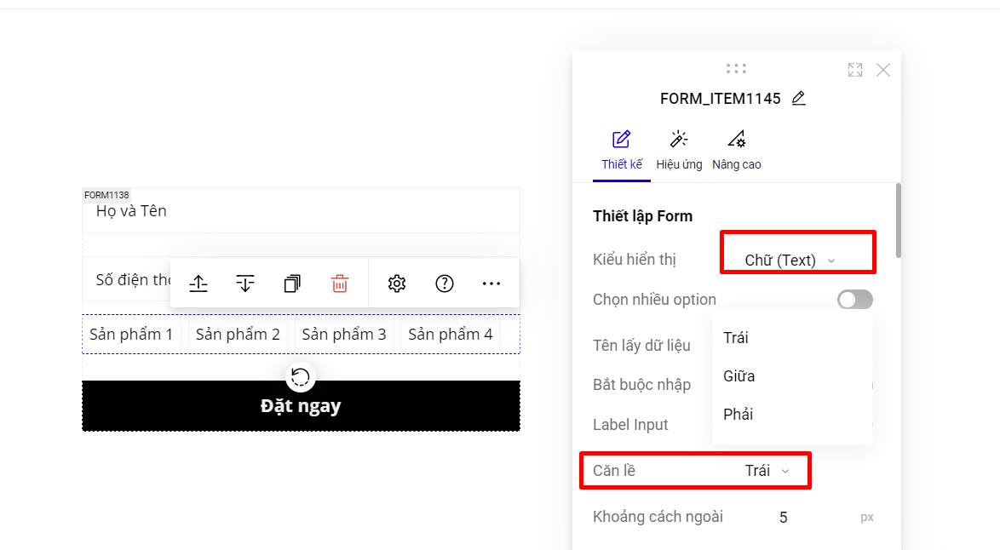

# 3. Trường sản phẩm

Trường sản phẩm giúp bạn thiết kế form đăng ký có phần lựa chọn giá trị sinh động và thuận tiện với khách hàng giúp tăng chuyển đổi. Để thiết lập bạn theo các bước sau:

**Bước 1: Thêm trường Sản phẩm.**

Bạn bấm vào form đăng ký chọn "Thêm trường" --> chọn trường "Sản Phẩm"

<figure><figcaption></figcaption></figure>

<figure><figcaption></figcaption></figure>

**Bước 2: Cài đặt Kiểu hiển thị cho trường Sản phẩm.**

Bạn chọn vào riêng trường Sản phẩm --> Thiết lập --> Kiểu hiển thị và chọn các kiểu hiển thị tương ứng.

<figure><figcaption></figcaption></figure>

* **Kiểu Hộp chọn giá trị:** Mặc định kiểu hiển thị của trường Sản Phẩm sẽ là kiểu "Hộp chọn giá trị", các giá trị lựa chọn hiển thị dạng xổ xuống và khách hàng chỉ được sử dụng 1 giá trị duy nhất.

<figure><figcaption></figcaption></figure>

* **Kiểu chữ (text):** Các giá trị lựa chọn hiển thị dạng Text, bạn có thể sử dụng Căn lề cho phần Kiểu Chữ này để hiển thị được đẹp.

<figure><figcaption></figcaption></figure>

**Kiểu Ảnh (Image)**: Các giá trị lựa chọn hiển thị dạng hình ảnh.

<figure><figcaption></figcaption></figure>

Bạn có thể tùy chỉnh hiển thị hình ảnh lựa chọn bằng cách sau:

<figure><figcaption></figcaption></figure>

* Kiểu Chữ và Ảnh (Text và Image): Các giá trị lựa chọn hiển thị dạng chữ kèm hình ảnh.&#x20;

<figure><figcaption></figcaption></figure>

* **Kiểu Chọn một giá trị (Radio):** Các giá trị hiển thị sẵn dạng tích chọn để khách hàng lựa chọn và khách hàng chỉ được chọn duy nhất một giá trị. Bạn có thể cài đặt kiểu hiển thị giá trị dạng Chiều Dọc hoặc Chiều Ngang.

<figure><figcaption></figcaption></figure>

* **Kiểu Chọn nhiều giá trị (Checkbox):** Các giá trị hiển thị sẵn dạng tích chọn để khách hàng lựa chọn và khách hàng có thể chọn nhiều giá trị. Bạn có thể cài đặt kiểu hiển thị giá trị dạng Chiều Dọc hoặc Chiều Ngang.

<figure><figcaption></figcaption></figure>

**Bước 3: Tùy chỉnh Danh sách Option.**

Để tùy chỉnh các giá trị, bạn bấm vào icon tùy chỉnh tại phần Danh sách Option.

<figure><figcaption></figcaption></figure>

* Tài khoản liên kết: Nếu bạn muốn sử dụng các sản phẩm từ các nền tảng KiotViet, Sapo, Haravan, Nhanh, Wordpress, Shopify&#x20;
