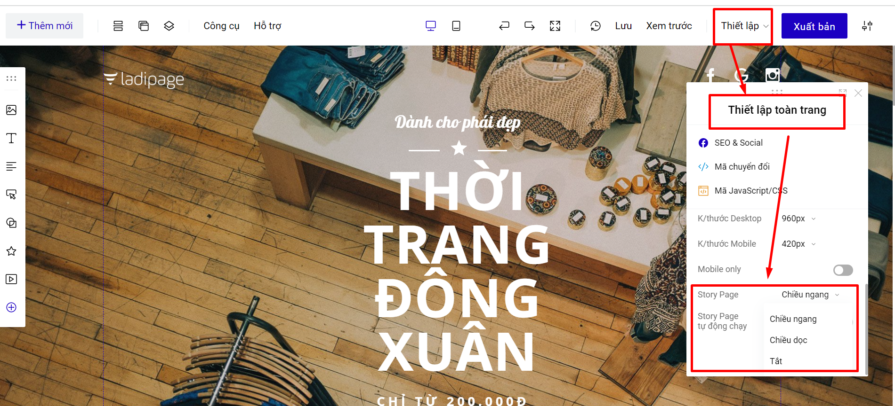
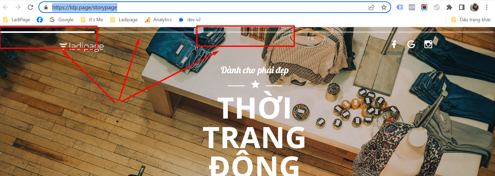

# Story page

Tính năng này cho phép bạn chuyển đổi trang landingpage của bạn thành dạng Story Page (tương tự tính năng Story của Facebook).

Mỗi 1 SECTION bạn thiết kế trên trang landingpage, sẽ thành 1 nội dung của 1 trang trên story page.

Để giao diện hiển thị được đẹp, **chiều cao SECTION của bạn thiết kế sẽ khoảng 500-700px.**

<figure><figcaption></figcaption></figure>

Bạn có thể chọn kiểu Story Page theo chiều ngang hoặc chiều dọc và bật chế độ tự động chạy hoặc không.

* Chiều ngang: Bạn sẽ không sử dụng chuột để cuộn landing page, và landing page sẽ không hiển thị ra toàn bộ nội dung của landing page.
* Chiều dọc: Mỗi 1 lần cuộn chuột của bạn sẽ hiển thị 1 section trên landing page của bạn.

**Demo landing page sử dụng story page kiểu Chiều ngang không tự động chạy:** [**https://ldp.page/storypagengang**](https://ldp.page/storypagengang)**.**

Khi bật Story Page thì trang landing page của bạn sẽ hiển thị các thanh ở trên đầu landing page, mỗi 1 thanh tương ứng với 1 section của landing page.

Ở chế độ không tự động chạy nếu bạn muốn chuyển section tiếp theo, bạn sẽ cần phải bấm vào cách thanh này để di chuyển các section tiếp theo (kiểu chiều ngang) hoặc cuộn chuột để chuyển các section tiếp theo (kiểu chiều dọc)

<figure><figcaption></figcaption></figure>

**Demo landing page sử dụng story page kiểu Chiều dọc không tự động chạy:** [https://ldp.page/storypagedoc](https://ldp.page/storypagedoc).


**Lưu ý**: Tính năng này chỉ hỗ trợ cho tài khoản LadiPage trả phí.

